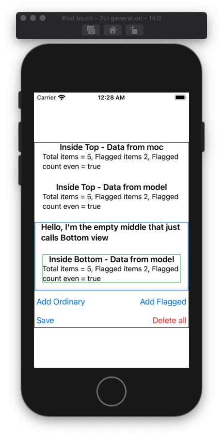

## Intro

***TL;DR;** Demo/test project showcasing easier to maintain Core Data processing in SwiftUI applications by abstracting Core Data processing away from the UI and into its own App Model.*

***Why***

Good SW engineering practice seeks to achieve a [Separation of Concerns](https://en.wikipedia.org/wiki/Separation_of_concerns). As of 10th of August 2020, the 'normal' SwiftUI approach to integration of Core Data involves data operations (using `@FetchRequest` and Core Data's Managed Object Context) within the immediate hierarchy of the `View` components that consume and create that same data. 

As convenient as it is to work with initially (particularly `@FetchRequest`) - splattering Core Data and associated processing throughout an application's UI components disobeys the Separation of Concerns and is liable to result in apps that are difficult maintain.

***What's demonstrated***

Alongside the conventional `@FetchRequest`/MOC approach for comparison, this project demonstrates how Core Data can be handled within an app's model, thereby separating data and UI concerns, while still maintaining ease of use.

- Alternative model based Core Data integration that:
	1. Keeps data synchronised across the views using a `Combine`publisher for the Core Data results.
	2. Is almost as convenient to work with as `@FetchRequest`
- A conventional `@FetchRequest` Core Data integration for comparison.
- How to setup Core Data using Xcode 12 and its `SwiftUI App` `Life Cycle` template I.e. without an `AppDelegate.swift` and `SceneDelegate.swift` to setup the Core Data `persistentContainer`, but with a model and the the usage of `@StateObject` to do the same.
- Use of the iOS14/SwiftUI's @StateObject`, `@Environment`, `@EnvironmentObject`, `@ObservedObject` and `@FetchRequest` property wrappers.

## Installation

This project requires at least iOS14 and Xcode 12 (I used Xcode 12.0 beta 4)

## Running/testing
Should run on any iOS 14+ simulator or device.

When it runs, the app will display summary data about the number of `Item` entities it has in the system in various View components.

Components are named after how they get their data, I.e. either from:
1. The Model
2. Or by using the 'normal' `@FetchRequest` and MOC approach

When normal and `flagged` Items are Added, the data across all of the View components should remain the same.

## Notes

1. The code contains copious comments and should be pretty self explanatory.
2. Kudos and thanks to Apostolos Giokas for his excellent [article on Medium ](https://medium.com/better-programming/combine-publishers-and-core-data-424b68fe9473) that contained the Core Data `Combine` publisher class implementation.
